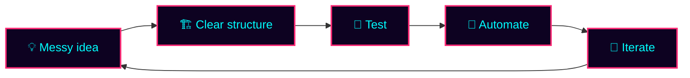
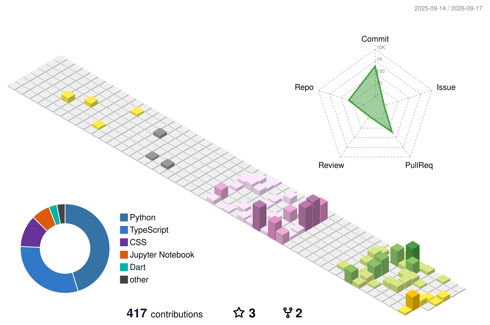

<!--
  Retro-Arcade + Cute GitHub Profile README
  Repo name must be: SALtruc/SALtruc
-->

 

---

<h2 align="center">🎮 INSERT COIN — PLAYER CARD</h2>

<table>
<tr>
<td width="58%" valign="top">

### Hi, I'm Truc Nguyen 👾

I'm an **AI / IT student at RMIT Vietnam** who enjoys turning messy ideas into working systems.

- 🧠 Currently exploring **AI agents, LLM tool-calling, and data quality workflows**
- ⚙️ Building with **Java / Spring Boot**, **React / Node.js**, and **Python**
- 🎮 Interested in **game tech**, **Godot**, and AI-powered interactive experiences
- 🧪 I care about readable code, testing, clean structure, and small iterations
- 🌱 Goal: become stronger at **AI engineering + full-stack product development**

 

</td>
<td width="42%" valign="top">

</td>
</tr>
</table>

---

<h2 align="center">⚔️ LOADOUT — TECH STACK</h2>

---

<h2 align="center">🗡️ QUEST LOG — PROJECTS</h2>

<b>🧬 Agentic Biosignal Quality Control System</b>

 

An AI-assisted workflow for checking ECG/PPG waveform data quality using controlled tools, explainable reports, and reviewer-friendly outputs.

**Role / Focus:** AI workflow design, backend planning, report structure, tool orchestration  
**Stack:** Python, FastAPI, LLM tool-calling, signal-processing libraries, React dashboard  
**Why it matters:** Helps transform raw medical waveform files into clearer quality-control decisions without pretending to make medical diagnoses.

<b>🧩 Sudoku Solver Benchmark System</b>

 

A Java-based Sudoku solver comparison project using multiple algorithms and benchmark outputs.

**Algorithms:** Backtracking, Constraint Propagation, DLX, DPLL-SAT  
**Focus:** Time complexity, memory usage, CSV benchmarking, difficulty detection  
**Win:** Built a stronger understanding of algorithm design, trade-offs, and performance measurement.

<b>🤖 ROSbot Obstacle Avoidance + QR Navigation</b>

 

A robotics project using ROS 2, LIDAR/OAK camera input, FSM navigation, and safety logic.

**Stack:** ROS 2, Python, Husarion ROSbot, OAK camera, Foxglove  
**Focus:** Sensor fusion, obstacle detection, safe movement, debugging robot behavior  
**Favorite part:** Making the robot behave more like a careful player instead of a confused NPC.

<b>🌐 Full-Stack Web Apps</b>

 

Web applications using React, Node.js, Express, Spring Boot, MongoDB, and SQL databases.

**Focus:** Authentication, backend API design, database schemas, frontend usability  
**Current direction:** Building cleaner APIs, stronger system design, and deployable product flows.

<b>🎮 Game Tech Experiments</b>

 

Small experiments with Godot and game-feel concepts.

**Focus:** Camera feel, interaction design, simple gameplay systems, and readable game architecture  
**Goal:** Combine AI + games into interactive tools, prototypes, or playful learning systems.

---

<h2 align="center">📊 BATTLE STATS</h2>

 

---

<h2 align="center">🏆 ACHIEVEMENTS UNLOCKED</h2>

---

<h2 align="center">🧪 ENGINEERING LOOP</h2>

---

<h2 align="center">🐍 CONTRIBUTION ARENA</h2>

<picture>
  <source media="(prefers-color-scheme: dark)" srcset="https://raw.githubusercontent.com/SALtruc/SALtruc/output/github-snake-neon.svg" />
  <source media="(prefers-color-scheme: light)" srcset="https://raw.githubusercontent.com/SALtruc/SALtruc/output/github-snake.svg" />
  
</picture>

---

<h2 align="center">🌈 3D CONTRIBUTION MAP</h2>

---

<h2 align="center">🔮 CURRENTLY GRINDING</h2>

<b>🔥 BOSS FIGHTS — click to engage</b>

 

| Boss | HP | Status | Drops |
|---|---:|---|---|
| 🧠 LLM tool-calling with controlled actions | ████████░░ | In progress | XP +500 |
| 📊 Explainable AI reports | ███████░░░ | Active | XP +350 |
| 🤖 Robotics behavior debugging | ██████░░░░ | Training | XP +300 |
| 🎮 Godot game-feel experiments | █████░░░░░ | Side quest | XP +250 |
| 🧪 Better tests + CI templates | ████████░░ | In progress | Cleaner builds |

---

<h2 align="center">📜 RANDOM SCROLL OF WISDOM</h2>

---

<h2 align="center">💾 SAVE FILE — CONTACT</h2>

 

